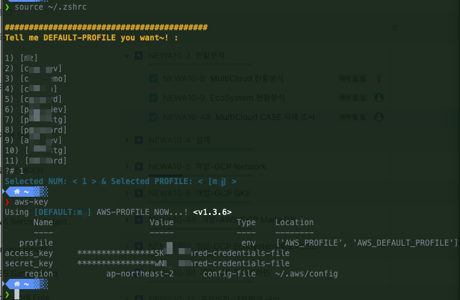
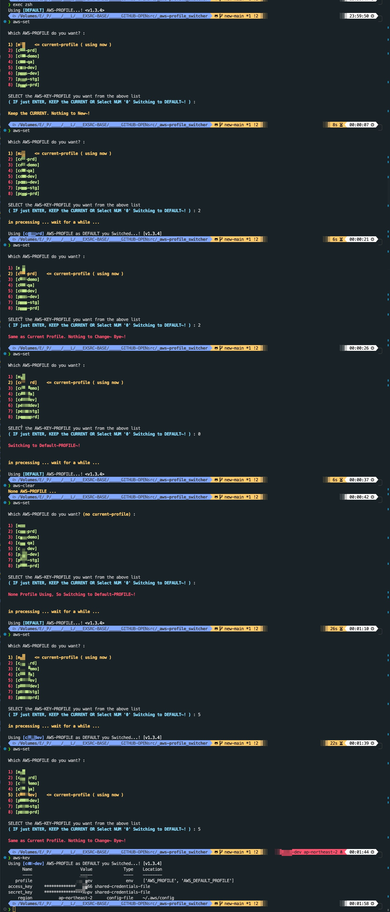

# ** aws-profile-switcher**

## PRE-REQUIRED :

```
동작환경 : 범용리눅스 환경 (amazon-linux2 기준)
> bash --version 4.x
> sed --version 4.x (gnu-sed)
> aws --version(aws-cli 2.x ) : V1 사용시 삭제 후 V2로 셋업필요

TEST 환경
> amazon-linux2
> macOS 13.0.1

-------------------------------------
macOS 의 경우 아래 추가셋업 필요 :

> bash 업데이트 후 디폴트 쉘 변경 ( bash --version 4.x higher )
  brew install bash, which bash 사용하여 path 확인 ( ex: /opt/homebrew/bin/bash )
  루팅 후 (sudo -i) /etc/shells 마지막줄에 해당 shell 경로 추가 ( ex: /opt/homebrew/bin/bash )
  디폴트 쉘 변경 ( chsh -s /opt/homebrew/bin/bash )
  심볼릭링크 추가 (ln -s /opt/homebrew/bin/bash /usr/local/bin/bash)
  쉘 재실행 ( exec bash OR exec zsh ) 후 디폴트 bash 버전확인 ( which bash && /usr/bin/env bash --version )

> 리눅스호환 gnu-sed 설치후 디폴트로 변경

  brew 패키지 매니저로 gnu-sed 설치 및 설치 후 설치경로 확인
  : brew install gnu-sed ; brew info gnu-sed

  쉘 환경파일에(.bashrc 또는 .zhsrc) gnu-sed PATH 경로추가 > 
  echo 'export PATH="/opt/homebrew/opt/gnu-sed/libexec/gnubin:$PATH" ' >> ~/.zshrc
  OR
  echo 'export PATH="/opt/homebrew/opt/gnu-sed/libexec/gnubin:$PATH" ' >> ~/.bashrc

  쉘 재실행 ( exec bash OR exec zsh ) 후 which sed 로 디폴트 경로 적용확인 및 버전확용 ( which sed && sed --version )
  ex : /opt/homebrew/opt/gnu-sed/libexec/gnubin/sed

```
## REFERENCE :
```
AWS-CLI V2 profile 환경변수 및 set command & ETC ... 
```
> DOCs: [AWS-CLI V2 SET & PROFILE](https://awscli.amazonaws.com/v2/documentation/api/latest/reference/configure/set.html)

## How to install :

```

### step1. get this tool download.
  ex> git clone <git-source>

### step2. backup aws config file
  ex> cp ~/.aws/config ~/.aws/config_bk_orign

### step3. give exec & write permission & copy this script to your path 
  1st $> chmod 755 .aws-pf-swtchr.sh && chmod 755 awscf_reset.sh 
  2nd $> cp awscf_reset.sh ~/.aws/awscf_reset.sh && cp .aws-pf-swtchr.sh ~/.aws-pf-swtchr.sh 

### step4. shell ENV setting & loading script in bashrc or zshrc 
  1st $> echo 'cp ~/.aws/config_bk_orign ~/.aws/config  ;' >> ~/.bashrc
    OR echo 'cp ~/.aws/config_bk_orign ~/.aws/config  ;' >> ~/.zshrc
  
  2nd $> echo 'pushd ~/.aws > /dev/null && { command -- ./awscf_reset.sh ;} ;' >> ~/.bashrc 
    OR echo 'pushd ~/.aws > /dev/null && { command -- ./awscf_reset.sh ;} ;' >> ~/.zshrc

  3rd $> echo 'popd > /dev/null 2> /dev/null ;' >> ~/.bashrc 
    OR echo 'popd > /dev/null 2> /dev/null ;' >> ~/.zshrc

  3rd $> echo 'cp ~/.aws/config ~/.aws/config_bk ;' >> ~/.bashrc 
    OR $> echo 'cp ~/.aws/config ~/.aws/config_bk ;' >> ~/.zshrc

  4th $> echo 'source ~/.aws-pf-swtchr.sh ;' >> ~/.bashrc 
    OR echo 'source ~/.aws-pf-swtchr.sh ;' >> ~/.zshrc


### step5. restart shell 
  ex) source ~/.bashrc OR source ~/.zshrc


REF. 트러블 슈팅
 간혹 vscode 플러그인 또는 쉘복원 기능 충돌 및 기타의 이유로 config 파일 내 값중복 또는 credential 매칭 문제로 
 profile parse 오류 발생시 쉘 재실행 후에도 해결되지 않을 경우 ~/.aws/config_bk 를 config 파일로 원복하여 쉘 재실행하여 해결

```
## RELEASE-HISTORY  :

```
V1.3.7
Added AWS-CONFIG auto reset-script for fixing parse error.

V1.3.6: 
Default external loading & display imprv.

V1.3.5: 
fixed unnecessary default loading.

V1.3.4: 
Added> On the aws-set step, smart checking current when just enter key or selected number using current.

V1.3.3: 
Added> Showing-current-profile, when aws-set step

V1.3.2: 
Added> displaying current-profile, when aws-set step

V1.2.7: 
Added> ReadME &Ver-display &ETC.

V1.2.3 :
Added > Validating Default Profile & message color Highlighting 

V1.2.2 :
fixed > grep&regex ERROR ( when just enter, no-input 예외처리 추가 )

===
V1.2.0 : 
Modify > 소스리팩토링 ( 가독성 개선 및 버전관리 )
>> 동적메뉴 리스팅& 컬러하일라이팅 ( 각 프로파일을 리스트번호로 선택 )
>> rc 환경 파일에서 분리 ( 별도의 스크립트를 쉘 rc 환경파일에서 로딩하여 사용 )
>> sed 커맨드 공통사용으로 개선 ( mac & linux )

===
beta ver 1.9 :
> aws-set 커맨드로 custom-profile 선택/변경시 해당 profile key 값으로 default 값 동적변경 
: ( 쉘 세션별로 독립적으로 서로다른 프로파일 사용가능)
> AWS CLI configure (VSCODE EXTENTION) 사용시 충돌해결
: ( AWS-PROFILE 리셋 및 예외처리 추가적용 ) 
> macOS & amazon-linux2 테스트 검증/ 확인 및 띄워쓰기 오류 및 오타수정

```
## Usage :

```

############### alias & sub-main : 아래 alias cmd 로 주요기능 실행 ##########

alias aws-cli="aws --version | cut -d ' ' -f1 "
alias aws-list="cat ~/.aws/credentials | grep -o '\[[^]]*\]' | grep -Ev 'default' "
alias aws-config="aws configure list"
alias aws-key="aws_profile; aws configure list; "
alias aws-set="aws_set $1"
alias aws-clear="aws_clear; aws_profile; "
alias aws-sts="aws sts get-caller-identity"

ex> aws-set or aws-key or aws-clear or aws-cli 등등 ... 

```

##################################################
### REF> First SETUP, DEFAULT PROFILE 설정:
step1: 
아래 이미지 처럼 쉘 환경파일 로딩 후, DEFAULT PROFILE 미설정시 사전에 설정된 프로파일 중 원하는 걸로 선택~!

> source ~/.bashrc OR source ~/.zshrc
> 참고로 ~/dft.txt 에 DEFAULT PROFILE 값 저장

step2: 
aws-key cmd 통해 설정된 프로파일 정보 확인





